<div align="center">
  
</div>


## Platforms Supported
Windows is currently the only platform supported.

## Installation
Clone the repo, download as a zip file, or use the following command...
```sh
pip install rotate-screen
```

## Documentation
The package comes with some functions to get available displays in the form of \<rotatescreen Display\> objects. You can then use the \<rotatescreen Display\> object methods to change the orientation of the display. 

#### Here are a few of the available package functions...

| Function | Returns |
|----------|---------|
| `rotatescreen.get_displays()` | Returns a list of \<rotatescreen Display\> objects for each available display.  |
| `rotatescreen.get_secondary_displays()` | Returns a list of \<rotatescreen Display\> objects for every display apart from the primary display. |
| `rotatescreen.get_primary_display()` | Returns a \<rotatescreen Display\> object for the primary display. |

#### Here are the available methods (no return value) for a \<rotatescreen Display\> object...

| Procedure | Arguments | Result |
|-----------|-----------|--------|
| `.rotate_to(pos)`         | pos (int): Degrees to rotate the screen to. Must be one of 0, 90, 180, 270. | Rotates the screen to desired. |
| `.set_landscape()`        || Rotates the screen to landscape. |
| `.set_landscape_flipped()`|| Rotates the screen to upside down landscape.|
| `.set_portrait()`         || Rotates the screen to portrait.|
| `.set_portrait_flipped()` || Rotates the screen to upside down portrait.|

#### Here are the available attributes for a \<rotatescreen Display\> object...

| Attribute | Returns |
|-----------|---------|
| `.current_orientation` | Returns (int) the current orientation of the display, will be one of 0, 90, 180, 270. |
| `.is_primary`          | Returns (bool) if the display is the primary monitor. |
| `.info`                | Returns (dict) monitor info. |
| `.device`              | Returns monitor device info. |
| `.device_description`  | Returns (str) visable name for display device. |

## Example: 
This is a simple example that implements the 'Ctrl+Alt+Arrow' keyboard shortcut for rotating the display. This is because some graphics cards don't come with this capability by default.

This example requires the keyboard module...
```sh
pip install keyboard
```
Here is the code! It adds hotkeys to rotate the primary display in the desired direction upon the user entering Ctrl, Alt and an arrow key. It then waits until the script is exited.
```python
import rotatescreen
import keyboard

screen = rotatescreen.get_primary_display()

keyboard.add_hotkey('ctrl+alt+up', screen.set_landscape, suppress=True)
keyboard.add_hotkey('ctrl+alt+right', screen.set_portrait_flipped, suppress=True)
keyboard.add_hotkey('ctrl+alt+down', screen.set_landscape_flipped, suppress=True)
keyboard.add_hotkey('ctrl+alt+left', screen.set_portrait, suppress=True)

keyboard.wait()
```

## Example: 
This was a little joke script to show off some more of the modules functionality, due to the way windows rotates the display this is a pretty horrific looking, but entertaining. :)
```python
import rotatescreen
import time

screen = rotatescreen.get_primary_display()
start_pos = screen.current_orientation

for i in range(1, 5):
    pos = abs((start_pos - i*90) % 360)
    screen.rotate_to(pos)
    time.sleep(1.5)
```
